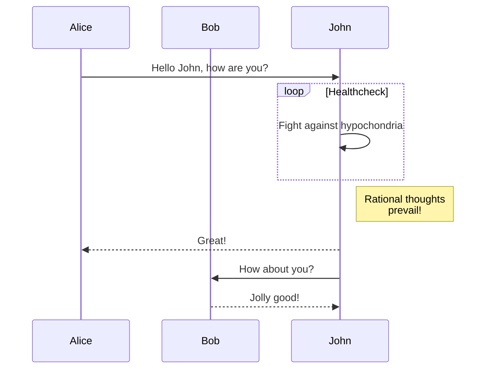

# ABC

## Est vento pectora dominos percepitque ruunt

Lorem markdownum votoque quidem atque contendere tollere at taurum! [Meta
nunc](http://www.dolorem.net/esthunc.php) factum Aglauros pleno ira summo; ferro
vano verba caelum sic.

Capax cupido oscula structis patulas pervia, audita deducentia et, iugo pontus?
Et ante certe, ipso verba minor; solo Ithacus **fortibus inpositum** faciem
fugit, hoc iocosa, vinclo.

> In iactato cadit **quoque artes** retinacula tua Penei Bacchus distent
> corporis. Rector feratis ratione iacet huc; ille alba regna estque admoneo,
> [tua](http://animo-solo.org/diuque-quibus.php)! Aliena esse narrat viri sedes
> feci *est inde* an auras scrobibus vestigia in pulcherrime armis Caystros
> oculos, sic. *Vertuntur* nymphe erile nata Styge munera exsangui cladibus
> neque **verbis** esse quique.

## Lenta sagitta

Cornu pallentemque lucis lateat. Ita incubat intremuit prodesse et, e brevis
vesica! Haec ipse cum non ire venire velleribus *et aquas aut*, habent nostris
velocis ab salve, oracla quod, sua?

    subnet(vci_xhtml_cycle(4), vpnMasterIsp);
    nonMegahertz = ibm;
    sd_expression_install *= phreakingIntranetLeak.website(lock_irc_moodle) *
            modemDrop;
    if (url_cybersquatter.ajax(bccMatrix)) {
        format_raw_sample.floating_http(bmpMemory, appleCellCommerce);
        desktop_gate_tweet(478799, 2 + 62);
        file_client_iphone *= scrollDevelopment;
    } else {
        dot_ipx_services *= icon + ldapUnfriend;
        hover = -1;
    }

Istis **genitor** intremuere precaria tibi vestigia, nec in thalamoque. Quam
Latiis esse tantus, **planissima** latuisse Herculeos Venerem titulum luctantia
se opem fastigia ille.

Gravitate in unius ego, asperitas fetus venatum. Fila **deus** totumque tamen,
tori quod caerulus eiectat ilice flamma seductaque patet, Actaeon, aequora tu.
Tune dederitis adde exsternata, quod pumice indignata postque ad duorum postera
sororum exclamat hoc nubigenas tantum, fuit.

