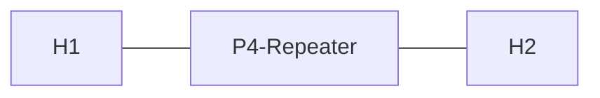

# Example 1: Repeater (aka Hub)

## Implementing a Repeater

* Repeater forwards data received on one port to all other ports
* Simple topology: host H1 and H2, connected to each port of the repeater
* All data received from H1 on port 1 should be forwarded to port 2 and vice versa
  * Repeater does not need to support and hence parse headers
  * Literally protocol-independent, just forwarding received/incoming data



## Discussion of ProNA P4 Repeater

```
if (std_meta.ingress_port == 1) { std_meta.egress_spec = 2; }
if (std_meta.ingress_port == 2) { std_meta.egress_spec = 1; }
```

* standard_metadata contains context information from switch pipeline
* ingress_port -> Port on which the packet came in 
* egress_spec -> spec(ification) of the port the packet should go out on
* "Software-defined" network logic: condition for repeater ports, define egress_port
* Only two lines of code needed in boilerplate to make "h1 ping h2" work
* However, the approach has several limitations: 
  * Repeater is rather dumb. How to build smarter network elements, being aware of traffic metadata?
  * How to include dynamic routing and forwarding decisions using a control plane during runtime?
  * How to handle traffic between more than two ports?
  * We'll address these challenges gradually in the next examples...
