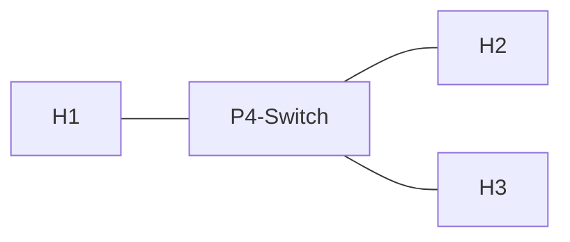

# Example 3: Learning Switch (L2 Forwarding incl. Flood & Filter)

## Background

This lab is based on the
[p4-learning](https://github.com/nsg-ethz/p4-learning) environment.
You can find further details regarding the implementation of a learning
switch in the corresponding
[exercise](https://github.com/nsg-ethz/p4-learning/tree/master/exercises/04-L2_Learning) by NSG-ETHZ.

## Implementing a Learning Switch

* Switch forwards Layer 2 frames, based on destination MAC address, learned from received frames source MAC address
* Flood & Filter functionality of a typical Layer 2 switch
  * Source MAC addresses from received packets should be learned (i.e., inserted in the MAC address table as future destinations) referencing the ingress port
  * If destination MAC address is not in the table or multicast/broadcast addressis used, flood the packet to all other egress ports (excluding the ingress port)
  * If destination MAC address is in the table, only use the egress port referenced in the table entry to forward the packet



```
H1 @ Port 1 of P4-Switch, MAC: 00:00:00:00:00:01
H2 @ Port 2 of P4-Switch, MAC: 00:00:00:00:00:02
H3 @ Port 3 of P4-Switch, MAC: 00:00:00:00:00:03
```

## P4Runtime / Control Plane
* We already implemented the Flooding (Broadcast) and Filtering (MAC address table) in the static switch
* How can we implement the learning part?
  * Learning was manually carried out using the CLI to add a table entry
  * CLI, API, gRPC etc. could be used to automatethis manual process (e.g., using a Python program)
  * This leads to the implementation of a smallControl Plane App to change switch config/logicduring runtime
  * We'll use the CPU port to inform our App, thata new MAC address was seen and insertinga new entry for this address in the table

## Extending the minimalistic switch to become a learning switch

### Add an additional srcMacAddr table

* Add a table to learn source MAC address, idea: if incoming source MAC address is already in the table -> do nothing (NoAction)
* if MAC address is not in the table, learn it by cloning the packet from ingress to egress (I2E) and sending it to the CPU port (using a port mirror in the switch)

### Add a new CPU packet protocol to be used to send learned MAC addresses to controller

* Use a custom CPU header to packets to controller via CPU port (containing MAC address to learn on ingress port)
* Be sure to add the cpu header to the deparser to include it in the outgoing packet

## Implement a controller app (learning_switch_controller_app_p4-learning.py)

* Implementation of a Python App on Control Plane using P4Runtime
* Uses Switch API to execute RuntimeCmds (which we did manually before), hence configuring table entries, multicast groups and mirror sessions during runtime
* Uses scapy to sniff on CPU port and use received packets (using the defined CPU header) to learn new MAC addresses and inserting them in the tables

### Initialization

* Upon initialization of the LearningSwitchControllerApp class, establish connection to Switch in running topology (uses p4-utils of  nsg-ethz)
* Add mcast groups to switch
* Add mirror session (to mirror packets to the CPU port) to the switch

### Adding mcast group and mirror using API instead of CLI

* Add mcast groups to switch using API, this is what we did manually before by using ```mc_mgrp_create```, ```mc_node_create``` and ```mc_node_associate```
* Add mirror session (could also be done manually using the CLI)

### Receive incoming CPU packets from mirror and add learned MAC addresses to srcMacAddr and dstMacAddr table

* Continuously sniff for packets on cpu port interface and treat received packets as information to learn about new mac addresses on ingress ports
* Add learned MAC addresses and their ports using switch API for table_add

## Task 1: Start controller

* Start the controller and see how it learns MAC addresses
* Start a ping from H1 to H2
* Are any packets sent from H1 to H2 also received by H3? Which ones? Why?

## Task 2: Remove learned MAC addresses from dstMacAddr table

* Remove all entries from dstMacAddr table
* Start a ping from H1 to H2 again
* Are any packets sent from H1 to H2 also received by H3? Which ones? Why?

## Discussion of ProNA P4 Learning Switch and possible next steps 

* Switch forwards Layer 2 frames, based on destination MAC address
* Implements flood & filter function of typical Layer 2 switch
* Broadcasts and packets going to unknown unicast MAC addresses are flooded to all ports except the port that the packet arrived on, try to comment out table_add to see every packet being flooded... same holds true when table is full... same for real-world switches...
* Packets destined to known unicast MAC addresses are forwarded only to the learned ports
* Implementation is still very basic, compared to real-world switches
* No "delearning"/aging of table entries, no VLANs, ... etc.
* Yet, now we saw all essential ingredients to implement more sophisticatednetwork elements and their functions
