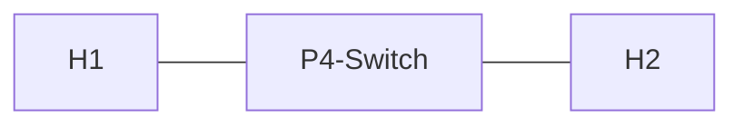

# Example 2: Minimalistic Switch (L2 Forwarding)

## Implementing a Switch

* Switch forwards Layer 2 frames, based on destination MAC address
* Correspondingly, topology now mentions MAC address of each host
* All frames reaching the switch with a destination MAC address of 00:00:00:00:00:02 should go out on Port 2, same for MAC address of H1 on Port 1
  * Layer 2 Ethernet header needs to be parsed
  * As for real-world Layer 2 network elements, switch needs a table to matchincoming destination MAC address and select approriate egress port



```
H1 @ Port 1 of P4-Switch, MAC: 00:00:00:00:00:01
H2 @ Port 2 of P4-Switch, MAC: 00:00:00:00:00:02
```

## Parser

* extract takes 48 + 48 + 16 bits (14 bytes) from the beginning of the packet
* Be sure to deparse all previously parsed and extracted or modified header data in egress

## Naive Layer 2 Forwarding

* Can we use the extracted header fields afterwards directly to do the following?

```
if (hdr.ethernet.dstAddr == 0x000000000001) { std_meta.egress_spec = 1; }
if (hdr.ethernet.dstAddr == 0x000000000002) { std_meta.egress_spec = 2; }
```

* That's possible and not as dumb as the repeater... but what about additional hosts? Where to send broadcast destination? Better use a MAC address table for match-action...

## Table-based Layer 2 Forwarding

* Define table with destination MAC address as key, for entry/line in table two actions are possible: forward or broadcast (default, e.g., for unknown MAC address or multicast/broadcast)
* Action forward is called like a function, getting egress_port as parameter, sets outgoing port (egress_spec) to port defined for MAC address in the table
* Action broadcast sets multicast group in standard metadata of switch (V1Model broadcast support)
* What will happen, when we start the switch like this? Which MAC addresses will be matched?

* We need to make sure, that broadcasts only go out to "all *other* ports" and not the one they where received on
* Hence drop broadcasts if they are about to go out on the port they came in from
```(std_meta.egress_port == std_meta.ingress_port)```

## Task 1: Add entries for MAC addresses to MyIngress.dstMacAddr using simple_switch_CLI

* Need to add entries to table during runtime, P4 code only specifies data plane logic, runtime handled by P4Runtime and Control Plane
* Can use Python API, gRPC or directly the CLI of the switch
* Add entries for MAC address of each host to MyIngress.dstMacAddr, specifying action (forward) and parameter (egress port)

## Task 2: Add a multicast group using simple_switch_CLI

* Need to create multicast group 1 (std_meta.mcast_grp = 1), by default switch does not know which ports should belong to the same broadcast domain (e.g., VLAN)
* Create a node 0 and add all ports (1, 2) to it
* Associate the node 0 to multicast group 1
...after adding this multicast group, we could even delete all entries in table dstMacAddr, as unknown MAC addresses (not having an entry in the table) will default to broadcast

## Result and next steps

* "h1 ping h2" will work... and we created a static Layer 2 switch. 
* How can we implement dynamic MAC address learning (also known as "flooding and filtering")?
